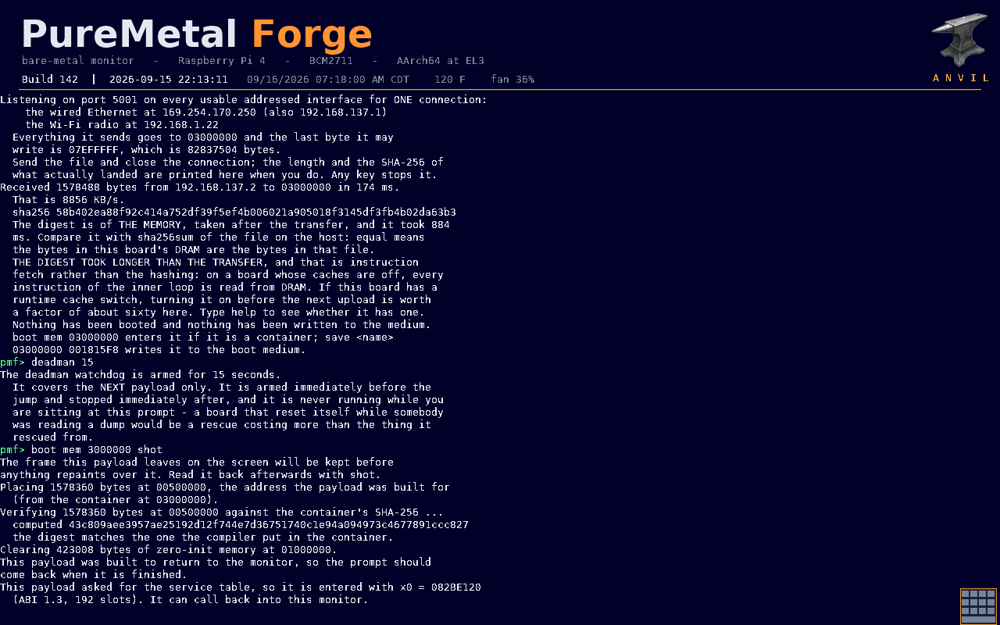
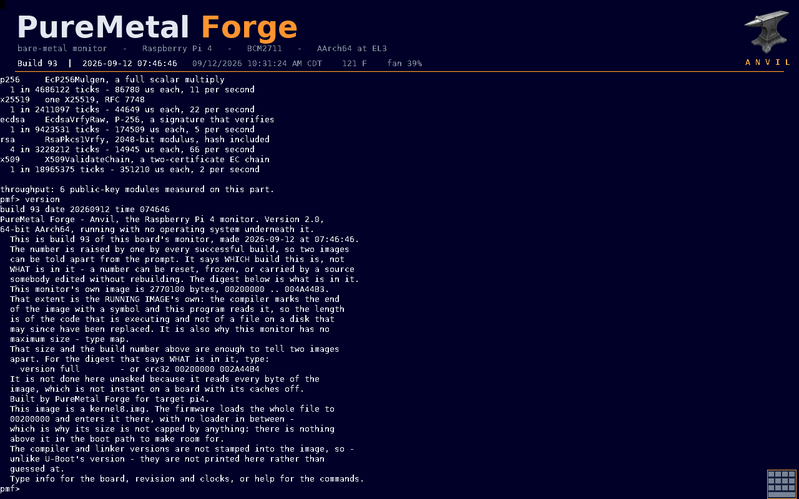
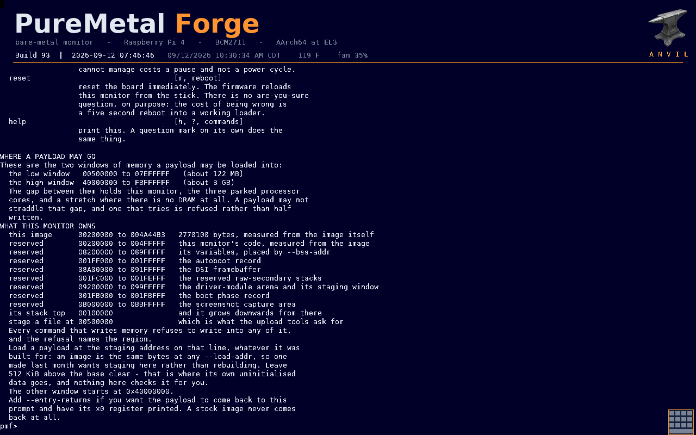
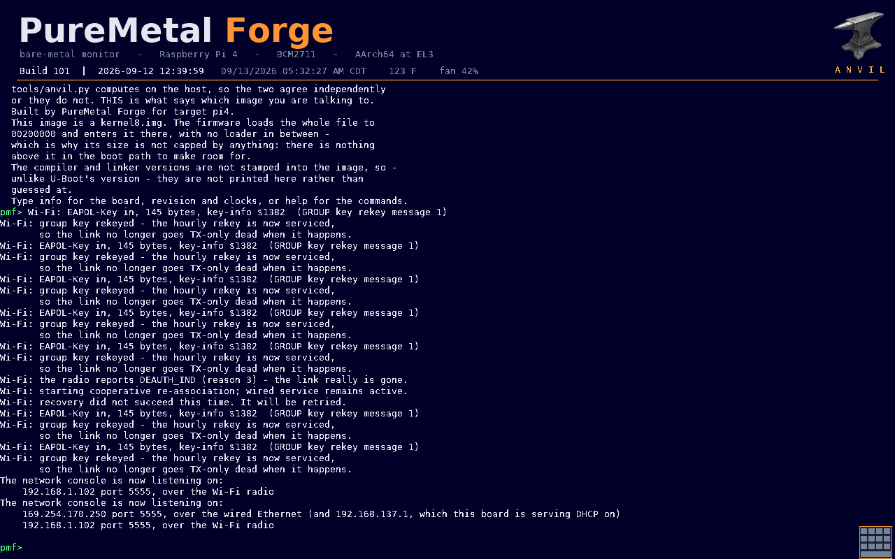
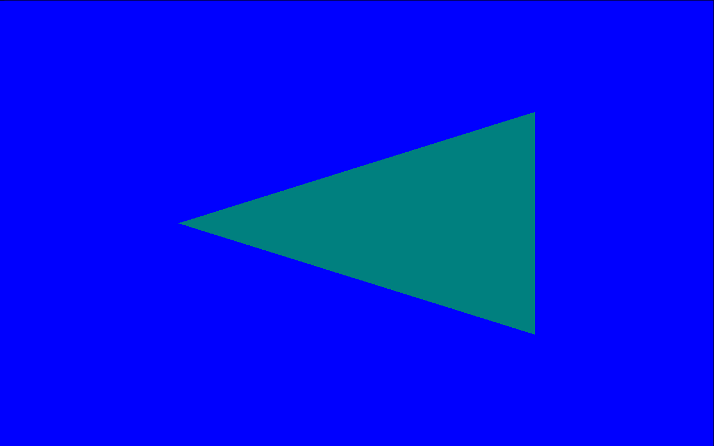

# Anvil

**A portable bare-metal mini-kernel, bootloader, and recovery monitor written
in PureMetal.**

[MIT licensed](LICENSE) · **[The Anvil Guide](docs/GUIDE.md)** ·
[Architecture](docs/ARCHITECTURE.md) ·
[Portability](docs/PORTABILITY.md) ·
[PureMetal Forge](https://puremetalforge.ajtaji.com/) ·
[Forums](https://forum.ajtaji.com/category/18/puremetal-forge) ·
[Anvil forum](https://forum.ajtaji.com/category/116/anvil) ·
[Issue tracker](https://github.com/ajtaji/Anvil/issues)

Anvil keeps one hardware-independent monitor core and composes it with the
drivers for a selected board. It remains resident while a payload runs, owns
the machine's physical services, and exposes a versioned service-table ABI to
payloads instead of making each payload bring a second hardware stack.

> **New here? Read [the guide](docs/GUIDE.md)** ([PDF](docs/guide/AnvilGuide.pdf)).
> Eleven chapters covering the build, installing on a Raspberry Pi 4, the
> console, writing and running payloads, all four cores, replacing the monitor
> in place, and how anything here is proven. The notes under `docs/` are the
> engineering record; the guide is the way in.

> [!IMPORTANT]
> Anvil is active development software for direct hardware access. It is not a
> finished distribution or a Vulkan-conformant implementation. Keep a known
> recovery path before installing a new image, and do not derive upload
> addresses from examples or previous builds. On the Pi, query and validate the
> running monitor's `map` response for every update.

## Anvil running

Every picture below was read back off the board itself. The monitor draws its
own console onto the panel it is driving; `p` streams the live frame over the
network and `shot` streams a kept one, and
[`tools/board_run.py`](tools/board_run.py) decodes that into a PNG on every
payload run. None of these is a mock-up or a desk render. See
[the screenshot service](docs/BOARD_RUN.md) for how a frame is kept and for the
two checks that stop a stale one passing as fresh.

| | |
|---|---|
| [](docs/images/payload-upload-and-boot.png) | **A payload arrives, is proved, and is entered.** 1,578,488 bytes land at `03000000` over TCP in 174 ms — 8,856 KB/s — and the board hashes its own DRAM to show the bytes are the file's. Then the deadman is armed for 15 seconds and `boot mem 3000000 shot` places the payload at the address it was built for, re-checks the container's SHA-256, and enters it with the ABI 1.3 service table in `x0`. |
| [](docs/images/version-at-el3.png) | **`version`, under a table of measured public-key throughput.** The monitor says which build it is, how large its own running image is, and — in its own words — why a build number is a label and the length plus a digest is the identity. The banner reads `AArch64 at EL3`: this board entered through the firmware stub at the highest privilege level the processor has. |
| [](docs/images/map-memory-windows.png) | **`map` — where a payload may go, and what the monitor owns.** The two staging windows and every reserved region, measured from the running image rather than baked into a constant. Host tools parse this instead of carrying a staging address, which is why chapter 6 tells you never to copy an address out of a note. |
| [](docs/images/network-console.png) | **The console arrives on the network by itself.** Hourly group-key rekeys are serviced in passing; then the radio reports a deauthentication, one cooperative re-association fails and says so rather than going quiet, and it is retried until the link is back. The console then announces itself on UDP port 5555 on *both* links at once — the wired Ethernet and the Wi-Fi radio, each with its own address, neither displacing the other. Nothing was typed on the board to arrange any of it. |
| [](docs/images/payload-drawn-frame.png) | **A frame the payload drew, not the monitor.** Source-over blending done by the Pi's V3D through the experimental Vulkan path. The monitor copied this frame out of the way as the first thing it did after the payload returned, before printing a single character — the monitor's own report of the return would otherwise have painted over the frame being asked about. |

## Run it on a Raspberry Pi 4

You do not have to build anything. A monitor image proven on hardware and the
boot-volume skeleton that goes around it are both in this repository:

```text
Boards/RaspberryPi4/sdcard/
  kernel8.img            build 165, the image below
  SHA256SUMS             check it with one command
  config.txt             the firmware settings, commented
  SETTINGS.TXT.example   optional; rename to SETTINGS.TXT
  README.md              the full card layout and first steps
```

**The image.** `Boards/RaspberryPi4/sdcard/kernel8.img` is build 165,
3,019,188 bytes, SHA-256
`0aef8f716baca0b6ba4d530711a82d232b0f47ba06d973f002546960ca1393e4`, built by
`tools/build.py` from this tree and recorded under that hash in the build
ledger. Rebuilding here will **not** reproduce it byte for byte: the build
number is stamped into the image and every build raises it
([why](docs/BUILD_NUMBER.md)), so your own build is 166 or later and differs
from this file in those bytes. Check this one before you copy it:

```sh
cd Boards/RaspberryPi4/sdcard && sha256sum -c SHA256SUMS
```

**If a boot fails**, type `trail` at the next prompt and send its output with
any `!! THE PREVIOUS BOOT STOPPED` lines the board printed - see
[the card README](Boards/RaspberryPi4/sdcard/README.md#if-a-boot-fails-send-this).

**The card.** We recommend **two partitions on an MBR medium**: partition 1 of
**1 GB, FAT32**, for the boot set, and partition 2 taking **the rest as exFAT**
for data — weights, voices, payloads, anything large, with no 4 GB file limit.
Then `settings set data.path 2:/` once, and every recipe's `data:/models/...`
resolves there. **A single FAT32 partition still works**: leave `data.path`
alone and `data:/` is the root of partition 1. The exact partitioning commands
for Windows, Linux and macOS are in
[the card README](Boards/RaspberryPi4/sdcard/README.md#how-to-lay-the-medium-out);
repartitioning erases the medium.

On **partition 1**, put five files: the three
Raspberry Pi firmware files (`start4.elf`, `fixup4.dat`,
`bcm2711-rpi-4-b.dtb`, which this repository does not redistribute),
`CONFIG.TXT`, and `KERNEL8.IMG`. There is **no `bootcode.bin` on a Pi 4** — it
boots its second stage from an onboard EEPROM. Names on the volume are 8.3.
[The skeleton README](Boards/RaspberryPi4/sdcard/README.md) says where to get
the firmware and what each file is for.

**The first prompt.** Wire a 3.3 V USB-to-serial adapter to header pins 6, 8
and 10 — ground, the Pi's transmit, the Pi's receive — at 115200 8N1, and
leave the adapter's VCC disconnected. Power the board. The banner names the
processor, the exception level and the two payload windows, and then `pmf>` is
the prompt. Run `version` and `map` first.

**The network console.** The monitor listens on **UDP port 5555** as soon as it
holds an address, on whichever interface has one. A Pi 4 on a bare Ethernet
cable into a laptop answers with nothing typed at either end — both sides take
a link-local address, and the board's is seeded from its hardware address, so
it is the same one across flashes.

```sh
python3 tools/anvil_wifi.py --find            # who is out there
python3 tools/anvil_wifi.py <board-ip>        # interactive console
python3 tools/board_run.py payload.pmf --console-ip <board-ip>
```

`board_run.py` is one complete run: it asks the board where to stage, streams
the container, proves it landed by comparing the board's own SHA-256 of its
memory against the file, arms the deadman, boots it, waits for the return
value, and brings back a screenshot.

Chapter 3 of the guide,
[Installing on a Raspberry Pi 4](docs/guide/03_installing_on_a_pi4.txt), is the
long version of all of this, including the EL3 stub and how to keep a way back.

## Target status

| Target | Boot model | Current status |
|---|---|---|
| Raspberry Pi 4 / BCM2711 / Cortex-A72 | Bare-metal AArch64 image | Most mature target. A recent hardware build booted with caches enabled, HDMI and native 1280×800 landscape DSI output, DMA-backed console rendering, and wired/Wi-Fi console access. A 2.2 MB RAM transfer was verified over Ethernet at approximately 10.97 MiB/s. The current tree contains newer display, network, and touch integration that still requires a complete on-board release pass. |
| Arduino UNO Q / QCM2290 / Cortex-A53 | AArch64 UEFI application | Early target. UEFI console and file access are in use, and GPIO has been exercised on hardware. Most native QCM2290 drivers, networking, display acceleration, and the Adreno path remain development work. |
| Raspberry Pi 3 Model B v1.2 / BCM2837 / Cortex-A53 | Bare-metal AArch64 image (`-t pi3`) | Early target. The cold-entry foundation and an immutable serial A/B updater are implemented and desk-tested; final SD-card update and recovery acceptance on the physical board remains. USB host and USB Ethernet are not brought up yet. See [RaspberryPi3/README.md](RaspberryPi3/README.md). |
| ROCK Pi 4C v1.2 / RK3399 / Cortex-A72 + A53 | arm64 U-Boot `Image` (`-t rockpi4c`) | Early target. MiniDP output is proven on hardware at 1024×768; the preferred 1920×1080 mode is not working yet. A UART recovery console (`help`, `reboot`) is proven on the board. No network command service yet. See [RockPi4C/README.md](RockPi4C/README.md). |

Host builds and emitted-code tests are valuable gates, but they are not a
substitute for hardware proof. Exact status and known boundaries are recorded
in [the architecture guide](docs/ARCHITECTURE.md).

The experimental Pi 4 Vulkan path now records bounded ordered draw lists,
exact source-over blending and public per-draw dynamic scissors, lowers a
complete list through one V3D bin/render transaction, batches its cache ranges
under one final barrier, and presents the finished attachment through display
DMA. The final 8x8 optimal-atlas IDE-chrome acceptance scene passed on the Pi 4:
build 148 returned exact `x0=0x6C85A0`, its 211-check report/pixel oracle passed,
and the run recorded one TFU advance, one bin/render pair and one DMA
presentation with a clean rotated 800x1280 capture. A resident Vulkan-backed
Neon adapter is now desk-green: the existing panel, menu, text and clipped-list
widgets run unchanged through persistent atlas, descriptor, pipeline and vertex
resources, 47 ordered draws, dynamic scissors, one frame submission and one
display-owner present intent. Its production full-stack image compiles and its
emitted/source/mutation gates pass, but this exact adapter frame still awaits
the shared Pi 4 lease and screenshot proof. This remains an experimental
bounded subset, not a Vulkan conformance claim.

The read-only Neon atlas contract now also reserves and publishes an opaque
white texel so solid boxes and glyphs share one sampled+tinted pipeline. Its
exact post-refactor diagnostic build is recorded in the compatibility status
and still needs the same returning Pi run once the shared board slot is free.

## What is in the tree

```text
Anvil/
  Core/                 portable monitor, boot, transfer and network policy
  Hal/                  hardware contract and payload/module ABIs
  Graphics/Vulkan/      experimental Vulkan-compatible foundation
RaspberryPi4/
  Board/                BCM2711 composition and board policy
  Lib/                  Pi drivers, display, V3D/Neon and networking
  Monitor/              source-native banner fonts and artwork
  Tests/                focused source and emitted-code probes
ArduinoQ/
  Board/                QCM2290 UEFI composition
  Lib/                  current native UNO Q drivers
RaspberryPi3/
  Board/, Boot/, Lib/   BCM2837 cold entry, serial updater, pinned boot files
RockPi4C/
  Board/, Lib/          RK3399 composition, MiniDP display and UART recovery
Boards/                  external-compiler target profile
Firmware/CYW43455/       Pi radio firmware (separately licensed)
licenses/                retained third-party license texts
docs/                    architecture, provenance, notices and formats
tools/                   build, verification and development gates
```

Shared code uses `.pbi`, Raspberry Pi 4 hardware code uses `.pi4`, UNO Q
hardware code uses `.unoq`, and the Pi 3 and ROCK Pi 4C board files use `.pi3`
and `.rockpi4c`. Target-specific names do not leak into the portable
HAL contract.

## Build

The PureMetal application (`PureMetalForge.exe`, or `PureMetalForge.linux` on
Linux) is an external dependency and is not included; it is free to download
from the [PureMetal Forge website](https://puremetalforge.ajtaji.com/). The same download
also includes the [ONNX compiler](https://github.com/ajtaji/Onnx-Compiler-Purebasic), ready
to run in `PureMetalForge\tools\onnx\`; building Anvil does not need it. The editor and the
compiler are one program: `--compile` builds from the command line with no
window, and there is no separate console compiler. Python 3 is used by the
repository wrapper and host checks; those scripts use only the standard
library.

Put `PureMetalForge` on `PATH`, set the `PMF_COMPILER` environment variable, or
pass it directly:

```sh
python3 tools/build.py all --compiler /path/to/PureMetalForge.exe
python3 tools/build.py pi4
python3 tools/build.py unoq
```

On PowerShell, use `python` if that is how Python is installed:

```powershell
$env:PMF_COMPILER = "C:\PureMetal\PureMetalForge.exe"
python tools/build.py all
```

Outputs are written under the ignored `build/` directory. The wrapper pins
`PMF_ROOT` to this checkout and stages the external compiler with this
repository's board profile in a temporary directory. Missing includes
therefore fail instead of being borrowed from another installation.

Target entries are
[`RaspberryPi4/Board/board.pi4`](RaspberryPi4/Board/board.pi4) and
[`ArduinoQ/Board/board.unoq`](ArduinoQ/Board/board.unoq).

### Experimental EL3 firmware stub

The optional Pi 4 stub has a separate, explicit build using a compiler with
`--armstub` support:

```sh
python3 tools/build.py armstub --compiler /path/to/PureMetalForge.exe
python3 tools/a64/a64_el3_check.py --compiler /path/to/PureMetalForge.exe
python3 tools/a64/el3_runtime_emitted_check.py --compiler /path/to/PureMetalForge.exe
```

This produces `build/pi4/armstub8.bin`; it is not part of `all` and is **not
installed automatically**. Build 98 and the checked stub passed a witnessed
physical power cycle on Pi 4: EL3 entry, the secure timer, controlled fault,
USB/storage and DMA/V3D display all passed. The final cleanup build 99 then
passed EL3, one 16-round run on all three secondary cores, stop acknowledgements
and the same peripheral checks after deployment. Build 99 then passed its exact
physical cold-power-cycle run, including cold leases, touch and Wi-Fi. The
EL3-to-EL1 handoff remains incomplete, so do not
change boot configuration without physical recovery access. Exact
artifacts and the remaining boundary are recorded in
[`docs/EL3_BOOT_ACCEPTANCE.md`](docs/EL3_BOOT_ACCEPTANCE.md). The stub retains
its upstream [BSD-3-Clause notice](RaspberryPi4/Board/armstub8.asm).

### Live time and returning applications

The common wall clock supports UTC, named U.S. Central time with daylight-saving
rules, and fixed offsets. On a network-capable board, synchronization runs as
bounded background work; an unreachable time server does not hold the prompt.
An unset clock or saved time floor is visibly unsynchronized, never presented
as a running battery-backed RTC.

```text
time
time sync
time zone America/Chicago
settings save
```

`time sync` is available only with a network backend. UNO Q currently supports
the common manual clock and zone commands, not network synchronization.
See [wall-clock commands and trust boundaries](docs/WALL_CLOCK.md).

The [panel/touch boot trace](docs/BOOT_I2C_TRACE.md) explains `touch trace`,
which reads retained failure evidence without initiating another hardware probe.

Returning applications have an explicit
[hardware ownership and Ethernet recovery contract](docs/PAYLOAD_LIFECYCLE.md).
The monitor stops active Ethernet DMA before entry and rebuilds the previously
active controller after return without erasing another interface or an
unexpired lease. These new service paths have desk gates; their remaining
silicon checks are documented separately from a completion claim.

### Boot and runtime assets

- The Pi build produces `build/pi4/anvil.img`, a raw bare-metal image. Vendor
  boot firmware, a complete boot partition, and board-specific display
  configuration are intentionally not bundled.
- The UNO Q build produces `build/unoq/anvil.img`. Wrap it as an AArch64 UEFI
  executable when needed:

  ```sh
  python3 tools/unoq_efi_wrap.py build/unoq/anvil.img build/unoq/anvil.efi --load-addr 0x70000000
  ```

- Pi 4 Wi-Fi requires the two CYW43455 binaries under `Firmware/CYW43455/`
  plus a board-appropriate NVRAM file that is deliberately not bundled. See
  [the licensing and asset guide](docs/LICENSING.md) for boot-media names and
  redistribution conditions.

## Verification

Before staging a release candidate, verify the complete non-ignored working
tree:

```sh
python3 tools/verify_export.py --working-tree
```

After selecting files with Git, verify the exact tracked public set:

```sh
python3 tools/verify_export.py
```

The verifier checks repository boundaries, required notices, source include
closures, and whether every dependency of both board entries is part of the
selected public tree. Git is the content-addressed manifest for the current
tree; `PROVENANCE.json` separately preserves the original migration mapping.

Focused development gates live under `tools/`, `RaspberryPi4/Tests/`, and
`Anvil/Graphics/Vulkan/Tests/`. Emitted AArch64 gates require the external
compiler and an interpreter supplied through `PMF_A64_INTERP` or the documented
repository-local path. The module gate, for example, is:

```sh
python3 tools/module_engine_check.py
```

The interpreter's lazy floating-point dependency has its own isolated host
gate, so a private installation cannot hide a missing exported helper:

```sh
python3 tools/a64/interpreter_dependency_check.py
```

The matching differential diagnostic sources are under
`RaspberryPi4/Examples/Diagnostics/`. They are not installed or run by a normal
build. Follow their hardware-state and recovery prerequisites before any
on-board use.

## Deliberately incomplete work

- **Driver modules:** PMFMOD v1 validation, relocation, and transactional arena
  records exist and have executable tests. Neither board activates the engine
  yet; discovery, loading, service binding, and safe reload are not present.
- **Vulkan compatibility:** the tree contains a pinned core-1.0 vocabulary
  slice, native object/command-buffer lifecycle work, and an explicitly named
  V3D development clear path. Production exposes no Vulkan physical device.
  Complete API vocabulary, memory and synchronization semantics, SPIR-V,
  pipelines, WSI, fault recovery, and CTS remain on the roadmap.
- **Current Pi integration:** lossless high-volume console modeling, rotated
  capture, banner activity, touch, and ongoing network changes must pass an
  integrated hardware run before they are described as released behavior.

See [the module format](docs/MODULE_FORMAT.md),
[Vulkan coverage](Anvil/Graphics/Vulkan/COVERAGE.md), and the
[Vulkan roadmap](Anvil/Graphics/Vulkan/ROADMAP.md) for exact boundaries.
The [compatibility inventory](docs/VULKAN_COMPATIBILITY_STATUS.md) maps the
implemented layers, missing prerequisites, and next resource-backed transfer
slice without claiming a production Vulkan device.

## Safety and support

Anvil can read and write physical memory and can replace a running monitor.
Treat images and addresses as build-specific. The Pi image measures its live
extent, guards monitor-owned memory, and reports the next staging window at
runtime; host tools should refuse an update when that report cannot be
validated unless an operator supplies an independently checked override.

Use the [GitHub issue tracker](https://github.com/ajtaji/Anvil/issues) for
reproducible defects and the [PureMetal forum](https://forum.ajtaji.com/) for
design and hardware discussion. Include the target, source revision, build
command, and a redacted transcript. Never post credentials, NVRAM calibration,
private keys, or machine-specific paths.

## License

Original Anvil source and documentation are available under the [MIT
License](LICENSE). Third-party material is not relicensed. This includes
CYW43455 firmware (redistributed under its own terms), vocabulary taken from
the Khronos Vulkan Registry, and glyph tables generated from DejaVu faces. The
cryptography is original code; BearSSL was read for its constant-time designs
and its licence text is kept as an acknowledgment. See the [licensing guide](docs/LICENSING.md)
and [third-party map](docs/THIRD_PARTY_NOTICES.md).
